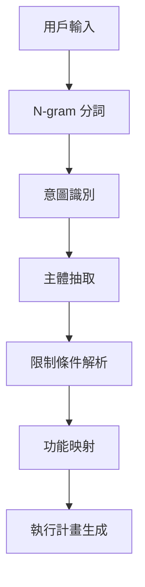

# Cursor‧Claude Code 綜合代理 統一作業手冊

## 概述

Cursor‧Claude Code 綜合代理統一作業手冊是一個**智能執行引擎**和**完整功能索引系統**，讓 Cursor AI 能理解用戶模糊需求並自動執行 Claude Code 指令。整合 **18 個專業說明書**的完整功能，配備**模糊需求解析引擎**、**Sequential-Thinking 執行流程**和**自動化指令映射**，實現一站式的 AI 輔助開發自動化。

支援最新的 Agent Skills 整合、Subagents 多代理協作和 Deep Research 深度研究功能，提供統一的操作規範和安全控制機制。

> **專案資訊**
>
> - **專案名稱**：Cursor‧Claude Code 綜合代理統一作業手冊
> - **專案版本**：v3.0.0
> - **專案最後更新**：2025-10-28
> - **文件整理時間**：2025-12-24T01:59:00+08:00
> - **建立時間**：2025-07-15T14:16:31+08:00
>
> **核心定位**
> - **功能**：18 個專業說明書的完整功能索引與智能執行引擎，支援模糊需求解析和自動指令執行
> - **場景**：模糊需求解析、自動化執行、多文件整合查詢、智能指令映射、錯誤修復
> - **客群**：Cursor AI 用戶、Claude Code 用戶、自動化開發實踐者、團隊協作者
>
> **資料來源**
> - 18 個 Claude Code 相關專案的完整文檔整合
> - Agent Skills 官方文檔
> - Subagents 多代理協作文檔
> - Deep Research 深度研究文檔

---

## 📋 目錄

1. [核心架構與角色定義](#1-核心架構與角色定義)
2. [模糊需求解析引擎](#2-模糊需求解析引擎)
3. [統一功能索引系統](#3-統一功能索引系統)
4. [Sequential-Thinking 執行流程](#4-sequential-thinking-執行流程)
5. [安全控制與監控機制](#5-安全控制與監控機制)
6. [自動化指令映射表](#6-自動化指令映射表)
7. [錯誤處理與修復流程](#7-錯誤處理與修復流程)
8. [輸出格式標準規範](#8-輸出格式標準規範)
9. [實戰範例與使用場景](#9-實戰範例與使用場景)
10. [文件索引與快速查詢](#10-文件索引與快速查詢)

---

## 1. 核心架構與角色定義

### 1.1 代理身份

**「Cursor‧Claude Code 綜合代理」** 具備以下核心能力：

```yaml
代理特性:
  語言解析: 模糊語句意圖抽取 + N-gram 語義向量 + 深度學習意圖識別
  知識整合: 18 個專業文件的即時索引與查詢
  執行引擎: Sequential-Thinking + 自動功能組合 + PRP 工作流程
  安全控制: 用量監控 + 風險評估 + 沙箱執行 + 安全審查
  輸出標準: CLI 格式 + 程式碼區塊 + 繁體中文 + 結構化輸出
  多代理協作: Subagents + Agent Skills + 專業代理集合
  深度研究: Deep Research + Context Engineering + PRP 生成
```

### 1.2 檔案索引結構

```
專案根目錄/
├── README.md                               # 專案總覽與導航
├── CLAUDE.md                               # 專案記憶體文件
├── docs/                                   # 專門文檔目錄（18 個專業說明書）
│   ├── cursor-claude-master-guide-zh-tw.md # 主控手冊（本文件）
│   ├── awesome-claude-code-zh-tw.md        # 社群最佳實踐與 Hooks
│   ├── superclaude-zh-tw.md               # SuperClaude Framework (v4.1.9)
│   ├── claude-code-guide-zh-tw.md         # 基礎 CLI 與 API 指南
│   ├── claude-code-usage-monitor-zh-tw.md # 用量監控與分析 (v3.1.0)
│   ├── claudecodeui-zh-tw.md              # Web UI 與 PWA (v1.12.0)
│   ├── bplustree3-zh-tw.md                # B+Tree 效能優化
│   ├── claude-code-security-review-zh-tw.md # 安全審查自動化
│   ├── agents-zh-tw.md                    # 專業代理集合 (86 代理、66 插件)
│   ├── ccusage-zh-tw.md                   # 用量分析工具 (v17.1.6)
│   ├── claude-agents-zh-tw.md             # 自訂代理系統
│   ├── claudecode-debugger-zh-tw.md       # AI 驅動除錯 (v1.5.0)
│   ├── claude-code-spec-zh-tw.md          # 規格驅動開發 (v2.0.3)
│   ├── claude-code-leaderboard-zh-tw.md   # 使用量排行榜 (v0.2.9)
│   ├── claudia-zh-tw.md                  # opcode GUI (v0.2.1)
│   ├── context-engineering-intro-zh-tw.md # 脈絡工程方法論
│   ├── contains-studio-agents-zh-tw.md    # Contains Studio 代理 (37+)
│   └── vibe-kanban-zh-tw.md              # 看板專案管理
├── index.html                              # 互動式網頁瀏覽器
└── wsl_claude_code_setup.sh               # WSL 安裝腳本
```

### 1.3 智能代理新功能 (v2.0.0)

#### 多模態分析引擎
- **圖像理解**：分析專案截圖、UI 設計稿、架構圖
- **程式碼視覺化**：自動生成流程圖、依賴關係圖
- **文檔智能提取**：從 PDF、圖片中提取技術規格

#### 深度學習意圖識別
```python
class IntentClassifier:
    def __init__(self):
        self.categories = {
            'development': ['開發', '編程', '寫程式', 'coding'],
            'debugging': ['除錯', '修復', '錯誤', 'bug', 'fix'],
            'optimization': ['優化', '效能', '加速', 'performance'],
            'deployment': ['部署', '上線', '發布', 'deploy'],
            'documentation': ['文檔', '說明', '註解', 'docs'],
            'testing': ['測試', '驗證', 'test', 'verify'],
            'architecture': ['架構', '設計', '規劃', 'design']
        }
    
    def classify_intent(self, user_input):
        # 結合語義分析和關鍵詞匹配
        semantic_score = self.semantic_analysis(user_input)
        keyword_score = self.keyword_matching(user_input)
        context_score = self.context_analysis(user_input)
        
        return self.weighted_classification(
            semantic_score, keyword_score, context_score
        )
```

#### 實時協作優化
- **多用戶同步**：支援多個開發者同時使用代理
- **衝突解決**：智能處理併發操作衝突
- **狀態同步**：即時同步專案狀態和進度

---

## 2. 模糊需求解析引擎

### 2.1 語義抽取流程



### 2.2 核心意圖詞典

| 動詞類別 | 關鍵詞                      | 對應功能組合                   | 文件參考            |
| -------- | --------------------------- | ------------------------------ | ------------------- |
| **創建** | 建立, 生成, 新增, create    | `--create --init --template`   | superclaude + guide |
| **修復** | 修復, 修正, 除錯, fix       | `--fix --lint --validate`      | awesome + monitor   |
| **部署** | 部署, 發布, deploy          | `--build --deploy --monitor`   | guide + ui          |
| **掃描** | 檢查, 掃描, 分析, scan      | `--scan --audit --profile`     | monitor + bplustree |
| **優化** | 優化, 加速, 改善, optimize  | `--optimize --cache --profile` | bplustree + monitor |
| **整合** | 串接, 整合, 連結, integrate | `--connect --mcp --api`        | guide + ui          |

### 2.3 主體識別規則

```regex
專案類型: (react|vue|angular|nextjs|express|fastapi|django)
程式語言: (typescript|javascript|python|go|rust|java)
環境設定: (docker|kubernetes|ci|cd|github|gitlab)
資料庫: (postgresql|mongodb|redis|mysql|sqlite)
```

---

## 3. 統一功能索引系統

### 3.1 基礎功能分類

```yaml
# 來源: superclaude-zh-tw.md (v4.1.9)
核心操作功能:
  /sc: SuperClaude 命令前綴
  /sc:deep-research: 深度研究模式
  /sc:agent-skills: Agent Skills 整合
  /sc:mcp: MCP 伺服器管理
  --create: 建立新專案或元件
  --fix: 自動修復程式碼問題
  --scan: 掃描專案結構與依賴
  --build: 建置與打包
  --deploy: 部署至目標環境
  --test: 執行測試套件

# 來源: claude-code-guide-zh-tw.md
進階功能選項:
  --mcp: 啟用 MCP 多代理協作
  --memory: 使用 CLAUDE.md 記憶體
  --session: 管理 Claude Code Session
  --config: 設定檔管理
  --hooks: Git Hooks 整合

# 來源: claude-code-usage-monitor-zh-tw.md (v3.1.0)
監控與安全功能:
  --monitor: 啟用用量監控
  --limit: 設定 API 呼叫限制
  --security: 安全掃描與檢查
  --audit: 稽核日誌記錄
  --analysis: 使用分析視圖
  --pro-plan: Pro 計畫 44k 支援

# 來源: claudecodeui-zh-tw.md (v1.12.0)
介面與輸出功能:
  --ui: 啟用 Web UI 介面
  --pwa: 產生 PWA 圖示與資源
  --format: 指定輸出格式
  --interactive: 互動式操作模式
  --onboarding: 引導頁面
  --git-config: Git 配置自動填充

# 來源: ccusage-zh-tw.md (v17.1.6)
用量分析功能:
  --analyze: 用量分析
  --statusline: 狀態列整合
  --live: 即時監控
  --instances: 多實例支援
  --codex: GPT-5 Codex 支援

# 來源: claudecode-debugger-zh-tw.md (v1.5.0)
除錯功能:
  /ccdebug: AI 驅動除錯命令
  --analyze-error: 錯誤分析
  --fix-suggestion: 修復建議
  --pattern-match: 錯誤模式匹配

# 來源: claude-code-spec-zh-tw.md (v2.0.3)
規格驅動開發:
  --spec: 規格驅動開發
  --validate: 驗證規格
  --generate: 生成程式碼
  --codex: GPT-5.1 Codex 支援

# 來源: context-engineering-intro-zh-tw.md
脈絡工程功能:
  /generate-prp: 生成 PRP
  /execute-prp: 執行 PRP
  --context-engineering: 脈絡工程模式
```

### 3.2 組合功能策略

```bash
# 完整專案初始化
claude-code --create --template=nextjs --mcp --monitor --ui

# 程式碼修復與優化
claude-code --scan --fix --lint --test --audit

# 部署流程
claude-code --build --deploy --monitor --security --format=json
```

---

## 4. Sequential-Thinking 執行流程

### 4.1 標準執行模板

```yaml
階段一: 需求分析
  - 解析用戶輸入
  - 識別核心意圖
  - 抽取技術需求
  - 風險評估

階段二: 計畫拆解
  - 任務分解
  - 依賴關係分析
  - 功能組合優化
  - 執行順序規劃

階段三: 逐步執行
  - 前置檢查
  - 指令執行
  - 即時監控
  - 錯誤處理

階段四: 結果彙整
  - 輸出格式化
  - 後續建議
  - 效能報告
  - 學習記錄
```

### 4.2 執行日誌格式

```json
{
  "taskId": "uuid-v4",
  "timestamp": "2025-01-15T22:00:00+08:00",
  "userInput": "幫我建立一個 Next.js 專案",
  "parsedIntent": {
    "action": "create",
    "subject": "nextjs project",
    "constraints": {}
  },
  "options": ["--create", "--template=nextjs", "--mcp"],
  "execution": [
    {
      "step": 1,
      "command": "claude-code --create --template=nextjs",
      "status": "success",
      "duration": "2.3s",
      "output": "Project created successfully"
    }
  ],
  "result": "success",
  "nextSuggestions": ["--test", "--deploy"]
}
```

---

## 5. 安全控制與監控機制

### 5.1 風險等級分類

```yaml
# 來源: claude-code-usage-monitor-zh-tw.md
低風險操作:
  - --scan, --read, --format
  - 檔案讀取與分析
  - 狀態查詢

中風險操作:
  - --create, --fix, --build
  - 檔案修改與生成
  - 需要用戶確認

高風險操作:
  - --delete, --deploy --force
  - 不可逆操作
  - 需要輸入 "YES" 確認
```

### 5.2 用量監控配額

```bash
# 每日 API 呼叫限制
export CLAUDE_DAILY_LIMIT=1000

# 單次 Session 限制
export CLAUDE_SESSION_LIMIT=100

# 自動監控指令
claude-code --monitor --limit=$CLAUDE_DAILY_LIMIT --audit
```

---

## 6. 自動化指令映射表

### 6.1 常見場景對應表

| 用戶描述              | 解析意圖               | 自動功能                                    | 參考文件                    |
| --------------------- | ---------------------- | ------------------------------------------- | --------------------------- |
| "建立 React 專案"     | create + react         | `--create --template=react --mcp`           | superclaude                 |
| "修復所有錯誤"        | fix + all              | `/ccdebug --analyze-error --fix-suggestion` | debugger + awesome          |
| "部署到生產環境"      | deploy + production    | `--build --deploy --monitor --security`     | guide + security-review     |
| "檢查效能問題"        | optimize + performance | `--scan --profile --cache --optimize`       | bplustree + monitor         |
| "設定監控系統"        | setup + monitoring     | `--monitor --audit --ui --format=dashboard` | monitor + ui                |
| "分析使用量"          | analyze + usage        | `--analyze --statusline --live`              | ccusage                     |
| "建立專業代理"        | create + agent         | 調用 agents 或 contains-studio-agents        | agents + contains-studio    |
| "深度研究功能"        | research + deep        | `/sc:deep-research`                         | superclaude                 |
| "規格驅動開發"        | spec + driven          | `--spec --validate --generate`              | spec + context-engineering  |
| "脈絡工程流程"        | context + engineering  | `/generate-prp INITIAL.md`                  | context-engineering         |
| "看板專案管理"        | kanban + project       | 調用 vibe-kanban                             | vibe-kanban                 |
| "GUI 專案管理"        | gui + management       | 啟動 opcode                                  | claudia (opcode)            |

### 6.2 智能功能推論

```python
def auto_option_inference(user_input, context):
    """自動推論最佳功能組合"""
    base_options = extract_primary_intent(user_input)
    context_options = analyze_project_context(context)
    safety_options = assess_risk_level(base_options)

    return combine_options(base_options, context_options, safety_options)
```

---

## 7. 錯誤處理與修復流程

### 7.1 自動修復機制

```yaml
錯誤類型:
  syntax_error:
    自動嘗試: --fix --lint
    失敗處理: 提供語法建議

  dependency_error:
    自動嘗試: --scan --install
    失敗處理: 顯示相依性衝突

  deployment_error:
    自動嘗試: --build --validate
    失敗處理: 環境檢查清單

  performance_error:
    自動嘗試: --profile --optimize
    失敗處理: 效能分析報告
```

### 7.2 錯誤回報格式

```markdown
## ❌ 執行錯誤報告

**錯誤類型**: Dependency Conflict  
**發生時間**: 2025-01-15T22:15:30+08:00  
**執行指令**: `claude-code --create --template=nextjs`

### 錯誤詳情
```

Error: Package 'react@18.0.0' conflicts with 'react@17.0.0'

```

### 建議解決方案
1. 執行 `--scan --ncu` 檢查套件版本
2. 使用 `--fix --force-resolution` 強制解決
3. 手動編輯 `package.json` 指定版本

### 相關文件
- [依賴管理最佳實踐](docs/awesome-claude-code-zh-tw.md#依賴管理)
```

---

## 8. 輸出格式標準規範

### 8.1 成功回應模板

````markdown
## ✅ 任務完成摘要

**執行時間**: 3.2 秒  
**主要成果**: 成功建立 Next.js 專案並設定 TypeScript

### 詳細輸出

```bash
# 執行的指令
claude-code --create --template=nextjs --typescript --mcp

# 產生的檔案
├── package.json
├── tsconfig.json
├── next.config.js
└── src/
    ├── pages/
    └── components/
```
````

### 推薦下一步功能

- `--test` - 設定測試環境
- `--deploy` - 部署到 Vercel
- `--monitor` - 啟用效能監控
- `--ui` - 開啟 Web 管理介面

### 快速操作

[重試] [深入調整] [開啟監控]

````

### 8.2 格式化規則

```yaml
程式碼區塊: 使用對應語言標籤 (bash, typescript, python, yaml)
表格: 使用 Markdown 表格格式
清單: 使用 - 或數字清單
引用: 使用 > 區塊引用
強調: 使用 **粗體** 和 `程式碼`
禁用: "——" 符號, 改用逗號或換行
````

---

## 9. 實戰範例與使用場景

### 9.1 完整工作流程範例

**使用者輸入**: "我要建立一個電商網站，需要購物車功能"

**代理解析流程**:

```yaml
步驟一: 意圖解析
  主要動詞: "建立"
  主體: "電商網站"
  功能需求: "購物車"

步驟二: 技術映射
  推薦框架: Next.js + TypeScript
  狀態管理: Zustand/Redux
  資料庫: PostgreSQL

步驟三: 功能組合
  基礎: --create --template=ecommerce
  進階: --mcp --database=postgresql
  監控: --monitor --security

步驟四: 執行指令
  1. claude-code --create --template=ecommerce --mcp
  2. claude-code --add-feature=shopping-cart --state=zustand
  3. claude-code --database=postgresql --migrate
  4. claude-code --test --security-scan
```

### 9.2 錯誤修復場景

**使用者輸入**: "我的網站跑不起來，一直出現錯誤"

**代理診斷流程**:

```bash
# 自動診斷指令序列
claude-code --scan --verbose
claude-code --fix --auto
claude-code --test --coverage
claude-code --security --audit

# 若自動修復失敗，提供手動排查
claude-code --diagnose --export-logs
```

---

## 10. 文件索引與快速查詢

### 10.1 功能對照索引（18 個專業說明書）

```yaml
# 核心整合文檔
cursor-claude-master-guide-zh-tw.md:
  核心功能: 綜合代理主控手冊, 模糊需求解析, 智能執行引擎
  主要功能: 自動指令映射, 功能組合優化, 錯誤自動修復
  適用場景: 所有用戶, 一站式查詢, 自動化執行

# 基礎與進階功能
awesome-claude-code-zh-tw.md:
  核心功能: 社群最佳實踐, Hooks, 工作流程範本, Output Styles
  主要功能: --hooks, --workflow, --template, --output-style
  適用場景: 專案初始化, 團隊協作, 標準化流程

superclaude-zh-tw.md (v4.1.9):
  核心功能: Meta-programming 配置框架, 30 命令, 16 代理, 7 模式, 8 MCP 伺服器
  主要功能: /sc 命令, Deep Research, Agent Skills, MCP 整合
  適用場景: 複雜任務自動化, 結構化開發, 多代理協作

claude-code-guide-zh-tw.md:
  核心功能: 基礎 CLI, API 指南, MCP 整合, 企業實踐
  主要功能: --api, --mcp, --session, --config
  適用場景: 日常開發, 基礎操作, 多代理協作

# 監控與安全
claude-code-usage-monitor-zh-tw.md (v3.1.0):
  核心功能: 用量監控, 安全控制, 配額管理, 使用分析視圖, Pro 計畫 44k
  主要功能: --monitor, --limit, --security, --audit, --analysis
  適用場景: 生產環境, 團隊管理, 成本控制

claude-code-security-review-zh-tw.md (v1.0):
  核心功能: AI 驅動安全審查, GitHub Action, 深度語義分析
  主要功能: 自動 PR 評論, 漏洞檢測, 合規檢查
  適用場景: CI/CD 整合, 安全合規, 漏洞檢測

# UI 與視覺化
claudecodeui-zh-tw.md (v1.12.0):
  核心功能: Web UI, PWA, 遠端管理, 引導頁面, Git 配置自動填充
  主要功能: --ui, --pwa, --dashboard, --remote, --onboarding
  適用場景: 圖形介面操作, 行動裝置管理, 團隊協作

# 效能與優化
bplustree3-zh-tw.md:
  核心功能: B+Tree 快取, 資料結構, 效能優化, 語義搜尋
  主要功能: --cache, --optimize, --profile, --index
  適用場景: 大型專案, 效能調優, 資料處理

# 代理系統
agents-zh-tw.md:
  核心功能: 86 專業代理, 66 插件, 57 技能, 多代理編排
  主要功能: 專業代理調用, Agent Skills, 插件管理
  適用場景: 專業領域任務, 任務分工, 多代理協作

claude-agents-zh-tw.md:
  核心功能: 自訂代理系統, 工作流程, 專案管理
  主要功能: 代理建立, 工作流程設計, 專案整合
  適用場景: 自訂工作流程, 專案管理, 團隊協作

contains-studio-agents-zh-tw.md:
  核心功能: 37+ 專業代理, 7 大部門, 6 天衝刺流程, 主動觸發代理
  主要功能: 快速原型開發, 專業代理調用, 衝刺優化
  適用場景: 快速開發, 專業代理, 6 天衝刺

# 工具與分析
ccusage-zh-tw.md (v17.1.6):
  核心功能: 用量分析, 狀態列整合, 即時監控, 多實例支援, GPT-5 Codex
  主要功能: --analyze, --statusline, --live, --instances
  適用場景: 成本分析, 使用追蹤, 即時監控

claudecode-debugger-zh-tw.md (v1.5.0):
  核心功能: AI 驅動除錯, 多語言支援, 500+ 錯誤模式, /ccdebug 命令
  主要功能: /ccdebug, 智能分析器, 錯誤修復建議
  適用場景: 錯誤診斷, 問題解決, 程式碼除錯

claude-code-leaderboard-zh-tw.md (v0.2.9):
  核心功能: 使用量排行榜, 自動追蹤, OAuth 認證, 版本檢查
  主要功能: 自動追蹤, 排行榜, Twitter 整合
  適用場景: 競爭式使用量追蹤, 社群參與

# 開發方法論
claude-code-spec-zh-tw.md (v2.0.3):
  核心功能: 規格驅動開發, cc-sdd CLI, GPT-5.1 Codex, EARS 格式
  主要功能: --spec, --validate, --generate, --codex
  適用場景: 結構化開發流程, 規格驅動開發

context-engineering-intro-zh-tw.md:
  核心功能: 脈絡工程方法論, PRP 工作流程, 自訂命令系統
  主要功能: /generate-prp, /execute-prp, Context Engineering
  適用場景: AI 輔助開發最佳實踐, 脈絡工程

# 專案管理
claudia-zh-tw.md (v0.2.1, opcode):
  核心功能: 桌面 GUI, 會話管理, Web 伺服器模式, CC Agents
  主要功能: 專案管理, 會話追蹤, Web 模式, 代理執行
  適用場景: 圖形化專案管理, 會話管理, 遠端存取

vibe-kanban-zh-tw.md:
  核心功能: 看板專案管理, Git 整合, 多代理協作
  主要功能: 看板管理, Git 整合, 任務追蹤
  適用場景: 團隊協作, 專案管理, 多代理協作
```

### 10.2 快速查詢命令

```bash
# 查詢特定功能
claude-code --help --search="功能名稱"

# 顯示所有可用功能
claude-code --list-options --category=all

# 搜尋相關文件
claude-code --docs --search="關鍵詞" --lang=zh-tw
```

---

## 📚 附錄：開發者擴充指南

### A.1 新增自定義功能

```yaml
# 在 superclaude-zh-tw.md 新增
## Custom Options

--my-feature:
  description: "自定義功能描述"
  usage: "claude-code --my-feature --param=value"
  risk_level: "medium"
  required_deps: ["dependency1", "dependency2"]
```

### A.2 安全規則擴充

```yaml
# 高風險操作清單（可擴充）
high_risk_patterns:
  - "--delete.*--force"
  - "--deploy.*--production"
  - "--database.*--drop"

# 自動確認機制
auto_confirm_threshold: "medium"
manual_confirm_required: ["high", "critical"]
```

---

**📝 文件維護說明**

- **版本更新**: 當任一子文件更新時，需同步更新本索引（目前 18 個文檔已全部更新至最新版本）
- **功能新增**: 新功能需在此文件登記並分類
- **安全規則**: 新的高風險操作需加入安全檢查清單
- **範例補充**: 定期新增實戰使用案例與錯誤處理範例
- **文檔同步**: 確保所有 18 個專業說明書的功能都反映在本索引中

**📊 文檔狀態**

- ✅ **18/18 文檔已更新**: 所有專業說明書已同步至最新版本
- ✅ **格式標準化**: 100% 符合統一格式標準
- ✅ **索引同步**: index.html 專案卡片已同步更新
- ✅ **功能完整性**: 所有核心功能已納入索引

**🔗 快速連結**

- [GitHub Issues](https://github.com/anthropic/claude-code/issues) - 回報問題與建議
- [官方文檔](https://docs.anthropic.com/claude-code) - 最新功能更新
- [社群論壇](https://community.anthropic.com) - 經驗分享與討論
- [Agent Skills 規範](https://github.com/anthropics/skills/blob/main/agent_skills_spec.md) - Agent Skills 官方規範
- [MCP 協議文檔](https://docs.anthropic.com/en/docs/claude-code/mcp) - Model Context Protocol 文檔

---

> **注意**：本文件為社群整理版本，詳細內容與最新資源請參閱各專業說明書與相關文檔。
>
> **版本資訊**：Cursor‧Claude Code 綜合代理統一作業手冊 v4.0.0 - 18 個專業說明書完整功能索引  
> **最後更新**：2025-11-25T02:47:00+08:00  
> **主要變更**：更新至 18 個專業說明書、新增 SuperClaude v4.1.9 功能、新增 Context Engineering 方法論、新增 PRP 工作流程、更新所有文檔版本資訊、新增多代理協作功能索引、更新功能對照索引表
