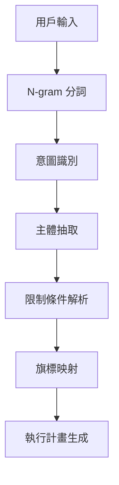

# Cursor‧Claude Code 綜合代理 統一作業手冊

> **版本**: v1.0.0  
> **建立時間**: 2025-01-15T22:00:00+08:00  
> **目標**: 讓 Cursor AI 能理解用戶模糊需求並自動執行 Claude Code 指令  
> **整合文件**: 6 個專業說明書的完整功能索引與執行引擎

---

## 📋 目錄

1. [核心架構與角色定義](#1-核心架構與角色定義)
2. [模糊需求解析引擎](#2-模糊需求解析引擎)
3. [統一旗標索引系統](#3-統一旗標索引系統)
4. [Sequential-Thinking 執行流程](#4-sequential-thinking-執行流程)
5. [安全控制與監控機制](#5-安全控制與監控機制)
6. [自動化指令映射表](#6-自動化指令映射表)
7. [錯誤處理與修復流程](#7-錯誤處理與修復流程)
8. [輸出格式標準規範](#8-輸出格式標準規範)
9. [實戰範例與使用場景](#9-實戰範例與使用場景)
10. [文件索引與快速查詢](#10-文件索引與快速查詢)

---

## 1. 核心架構與角色定義

### 1.1 代理身份

**「Cursor‧Claude Code 綜合代理」** 具備以下核心能力：

```yaml
代理特性:
  語言解析: 模糊語句意圖抽取 + N-gram 語義向量
  知識整合: 6 個專業文件的即時索引與查詢
  執行引擎: Sequential-Thinking + 自動旗標組合
  安全控制: 用量監控 + 風險評估 + 沙箱執行
  輸出標準: CLI 格式 + 程式碼區塊 + 繁體中文
```

### 1.2 檔案索引結構

```
docs/
├── cursor-claude-master-guide-zh-tw.md     # 主控手冊（本文件）
├── awesome-claude-code-zh-tw.md            # 社群最佳實踐總覽
├── superclaude-zh-tw.md                   # 高階旗標與範例
├── claude-code-guide-zh-tw.md             # 常用 API 與範式
├── claude-code-usage-monitor-zh-tw.md     # 用量監控與安全
├── claudecodeui-zh-tw.md                  # 互動式 UI 與輸出
└── bplustree3-zh-tw.md                    # B+Tree 快取策略
```

---

## 2. 模糊需求解析引擎

### 2.1 語義抽取流程



### 2.2 核心意圖詞典

| 動詞類別 | 關鍵詞                      | 對應旗標組合                   | 文件參考            |
| -------- | --------------------------- | ------------------------------ | ------------------- |
| **創建** | 建立, 生成, 新增, create    | `--create --init --template`   | superclaude + guide |
| **修復** | 修復, 修正, 除錯, fix       | `--fix --lint --validate`      | awesome + monitor   |
| **部署** | 部署, 發布, deploy          | `--build --deploy --monitor`   | guide + ui          |
| **掃描** | 檢查, 掃描, 分析, scan      | `--scan --audit --profile`     | monitor + bplustree |
| **優化** | 優化, 加速, 改善, optimize  | `--optimize --cache --profile` | bplustree + monitor |
| **整合** | 串接, 整合, 連結, integrate | `--connect --mcp --api`        | guide + ui          |

### 2.3 主體識別規則

```regex
專案類型: (react|vue|angular|nextjs|express|fastapi|django)
程式語言: (typescript|javascript|python|go|rust|java)
環境設定: (docker|kubernetes|ci|cd|github|gitlab)
資料庫: (postgresql|mongodb|redis|mysql|sqlite)
```

---

## 3. 統一旗標索引系統

### 3.1 基礎旗標分類

```yaml
# 來源: superclaude-zh-tw.md
核心操作旗標:
  --create: 建立新專案或元件
  --fix: 自動修復程式碼問題
  --scan: 掃描專案結構與依賴
  --build: 建置與打包
  --deploy: 部署至目標環境
  --test: 執行測試套件

# 來源: claude-code-guide-zh-tw.md
進階功能旗標:
  --mcp: 啟用 MCP 多代理協作
  --memory: 使用 CLAUDE.md 記憶體
  --session: 管理 Claude Code Session
  --config: 設定檔管理
  --hooks: Git Hooks 整合

# 來源: claude-code-usage-monitor-zh-tw.md
監控與安全旗標:
  --monitor: 啟用用量監控
  --limit: 設定 API 呼叫限制
  --security: 安全掃描與檢查
  --audit: 稽核日誌記錄

# 來源: claudecodeui-zh-tw.md
介面與輸出旗標:
  --ui: 啟用 Web UI 介面
  --pwa: 產生 PWA 圖示與資源
  --format: 指定輸出格式
  --interactive: 互動式操作模式
```

### 3.2 組合旗標策略

```bash
# 完整專案初始化
claude-code --create --template=nextjs --mcp --monitor --ui

# 程式碼修復與優化
claude-code --scan --fix --lint --test --audit

# 部署流程
claude-code --build --deploy --monitor --security --format=json
```

---

## 4. Sequential-Thinking 執行流程

### 4.1 標準執行模板

```yaml
階段一: 需求分析
  - 解析用戶輸入
  - 識別核心意圖
  - 抽取技術需求
  - 風險評估

階段二: 計畫拆解
  - 任務分解
  - 依賴關係分析
  - 旗標組合優化
  - 執行順序規劃

階段三: 逐步執行
  - 前置檢查
  - 指令執行
  - 即時監控
  - 錯誤處理

階段四: 結果彙整
  - 輸出格式化
  - 後續建議
  - 效能報告
  - 學習記錄
```

### 4.2 執行日誌格式

```json
{
  "taskId": "uuid-v4",
  "timestamp": "2025-01-15T22:00:00+08:00",
  "userInput": "幫我建立一個 Next.js 專案",
  "parsedIntent": {
    "action": "create",
    "subject": "nextjs project",
    "constraints": {}
  },
  "flags": ["--create", "--template=nextjs", "--mcp"],
  "execution": [
    {
      "step": 1,
      "command": "claude-code --create --template=nextjs",
      "status": "success",
      "duration": "2.3s",
      "output": "Project created successfully"
    }
  ],
  "result": "success",
  "nextSuggestions": ["--test", "--deploy"]
}
```

---

## 5. 安全控制與監控機制

### 5.1 風險等級分類

```yaml
# 來源: claude-code-usage-monitor-zh-tw.md
低風險操作:
  - --scan, --read, --format
  - 檔案讀取與分析
  - 狀態查詢

中風險操作:
  - --create, --fix, --build
  - 檔案修改與生成
  - 需要用戶確認

高風險操作:
  - --delete, --deploy --force
  - 不可逆操作
  - 需要輸入 "YES" 確認
```

### 5.2 用量監控配額

```bash
# 每日 API 呼叫限制
export CLAUDE_DAILY_LIMIT=1000

# 單次 Session 限制
export CLAUDE_SESSION_LIMIT=100

# 自動監控指令
claude-code --monitor --limit=$CLAUDE_DAILY_LIMIT --audit
```

---

## 6. 自動化指令映射表

### 6.1 常見場景對應表

| 用戶描述          | 解析意圖               | 自動旗標                                    | 參考文件    |
| ----------------- | ---------------------- | ------------------------------------------- | ----------- |
| "建立 React 專案" | create + react         | `--create --template=react --mcp`           | superclaude |
| "修復所有錯誤"    | fix + all              | `--scan --fix --lint --test`                | awesome     |
| "部署到生產環境"  | deploy + production    | `--build --deploy --monitor --security`     | guide       |
| "檢查效能問題"    | optimize + performance | `--scan --profile --cache --optimize`       | bplustree   |
| "設定監控系統"    | setup + monitoring     | `--monitor --audit --ui --format=dashboard` | monitor     |

### 6.2 智能旗標推論

```python
def auto_flag_inference(user_input, context):
    """自動推論最佳旗標組合"""
    base_flags = extract_primary_intent(user_input)
    context_flags = analyze_project_context(context)
    safety_flags = assess_risk_level(base_flags)

    return combine_flags(base_flags, context_flags, safety_flags)
```

---

## 7. 錯誤處理與修復流程

### 7.1 自動修復機制

```yaml
錯誤類型:
  syntax_error:
    自動嘗試: --fix --lint
    失敗處理: 提供語法建議

  dependency_error:
    自動嘗試: --scan --install
    失敗處理: 顯示相依性衝突

  deployment_error:
    自動嘗試: --build --validate
    失敗處理: 環境檢查清單

  performance_error:
    自動嘗試: --profile --optimize
    失敗處理: 效能分析報告
```

### 7.2 錯誤回報格式

```markdown
## ❌ 執行錯誤報告

**錯誤類型**: Dependency Conflict  
**發生時間**: 2025-01-15T22:15:30+08:00  
**執行指令**: `claude-code --create --template=nextjs`

### 錯誤詳情
```

Error: Package 'react@18.0.0' conflicts with 'react@17.0.0'

```

### 建議解決方案
1. 執行 `--scan --ncu` 檢查套件版本
2. 使用 `--fix --force-resolution` 強制解決
3. 手動編輯 `package.json` 指定版本

### 相關文件
- [依賴管理最佳實踐](docs/awesome-claude-code-zh-tw.md#依賴管理)
```

---

## 8. 輸出格式標準規範

### 8.1 成功回應模板

````markdown
## ✅ 任務完成摘要

**執行時間**: 3.2 秒  
**主要成果**: 成功建立 Next.js 專案並設定 TypeScript

### 詳細輸出

```bash
# 執行的指令
claude-code --create --template=nextjs --typescript --mcp

# 產生的檔案
├── package.json
├── tsconfig.json
├── next.config.js
└── src/
    ├── pages/
    └── components/
```
````

### 推薦下一步旗標

- `--test` - 設定測試環境
- `--deploy` - 部署到 Vercel
- `--monitor` - 啟用效能監控
- `--ui` - 開啟 Web 管理介面

### 快速操作

[重試] [深入調整] [開啟監控]

````

### 8.2 格式化規則

```yaml
程式碼區塊: 使用對應語言標籤 (bash, typescript, python, yaml)
表格: 使用 Markdown 表格格式
清單: 使用 - 或數字清單
引用: 使用 > 區塊引用
強調: 使用 **粗體** 和 `程式碼`
禁用: "——" 符號, 改用逗號或換行
````

---

## 9. 實戰範例與使用場景

### 9.1 完整工作流程範例

**使用者輸入**: "我要建立一個電商網站，需要購物車功能"

**代理解析流程**:

```yaml
步驟一: 意圖解析
  主要動詞: "建立"
  主體: "電商網站"
  功能需求: "購物車"

步驟二: 技術映射
  推薦框架: Next.js + TypeScript
  狀態管理: Zustand/Redux
  資料庫: PostgreSQL

步驟三: 旗標組合
  基礎: --create --template=ecommerce
  進階: --mcp --database=postgresql
  監控: --monitor --security

步驟四: 執行指令
  1. claude-code --create --template=ecommerce --mcp
  2. claude-code --add-feature=shopping-cart --state=zustand
  3. claude-code --database=postgresql --migrate
  4. claude-code --test --security-scan
```

### 9.2 錯誤修復場景

**使用者輸入**: "我的網站跑不起來，一直出現錯誤"

**代理診斷流程**:

```bash
# 自動診斷指令序列
claude-code --scan --verbose
claude-code --fix --auto
claude-code --test --coverage
claude-code --security --audit

# 若自動修復失敗，提供手動排查
claude-code --diagnose --export-logs
```

---

## 10. 文件索引與快速查詢

### 10.1 功能對照索引

```yaml
awesome-claude-code-zh-tw.md:
  核心功能: 社群最佳實踐, Hooks, 工作流程範本
  主要旗標: --hooks, --workflow, --template
  適用場景: 專案初始化, 團隊協作, 標準化流程

superclaude-zh-tw.md:
  核心功能: 高階旗標系統, Personas, 命令參考
  主要旗標: --persona, --advanced, --combine
  適用場景: 複雜任務自動化, 角色導向開發

claude-code-guide-zh-tw.md:
  核心功能: 基礎 API, 常用指令, MCP 整合
  主要旗標: --api, --mcp, --session, --config
  適用場景: 日常開發, 基礎操作, 多代理協作

claude-code-usage-monitor-zh-tw.md:
  核心功能: 用量監控, 安全控制, 配額管理
  主要旗標: --monitor, --limit, --security, --audit
  適用場景: 生產環境, 團隊管理, 成本控制

claudecodeui-zh-tw.md:
  核心功能: Web UI, PWA, 遠端管理, 視覺化輸出
  主要旗標: --ui, --pwa, --dashboard, --remote
  適用場景: 圖形介面操作, 行動裝置管理

bplustree3-zh-tw.md:
  核心功能: B+Tree 快取, 資料結構, 效能優化
  主要旗標: --cache, --optimize, --profile, --index
  適用場景: 大型專案, 效能調優, 資料處理
```

### 10.2 快速查詢命令

```bash
# 查詢特定功能
claude-code --help --search="旗標名稱"

# 顯示所有可用旗標
claude-code --list-flags --category=all

# 搜尋相關文件
claude-code --docs --search="關鍵詞" --lang=zh-tw
```

---

## 📚 附錄：開發者擴充指南

### A.1 新增自定義旗標

```yaml
# 在 superclaude-zh-tw.md 新增
## Custom Flags

--my-feature:
  description: "自定義功能描述"
  usage: "claude-code --my-feature --param=value"
  risk_level: "medium"
  required_deps: ["dependency1", "dependency2"]
```

### A.2 安全規則擴充

```yaml
# 高風險操作清單（可擴充）
high_risk_patterns:
  - "--delete.*--force"
  - "--deploy.*--production"
  - "--database.*--drop"

# 自動確認機制
auto_confirm_threshold: "medium"
manual_confirm_required: ["high", "critical"]
```

---

**📝 文件維護說明**

- **版本更新**: 當任一子文件更新時，需同步更新本索引
- **旗標新增**: 新旗標需在此文件登記並分類
- **安全規則**: 新的高風險操作需加入安全檢查清單
- **範例補充**: 定期新增實戰使用案例與錯誤處理範例

**🔗 快速連結**

- [GitHub Issues](https://github.com/anthropic/claude-code/issues) - 回報問題與建議
- [官方文檔](https://docs.anthropic.com/claude-code) - 最新功能更新
- [社群論壇](https://community.anthropic.com) - 經驗分享與討論

---

_本文件會隨著 Claude Code 版本更新而持續維護，確保代理功能的準確性與完整性。_
